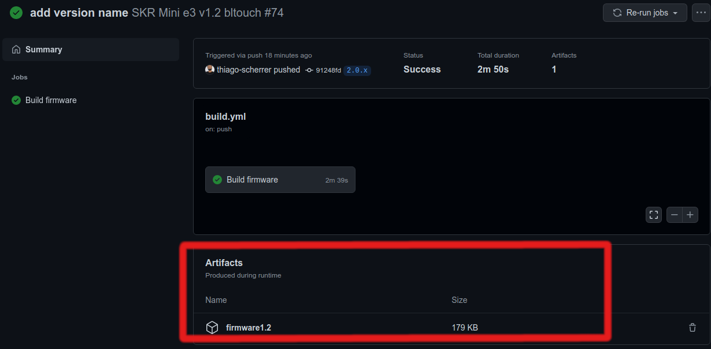

# mabg

Marlin auto build generation with github action

## why

I use a rapyberry as my personal computer (yes) and compiling Marlin for my
ender3 is tiring. So I created this action to help

## how to

- Fork Marlin's Repository, make all the changes you need to this fork to make
it work on your printer and then create a new action file on
`.github/workflows/build.yml` with this content:

```yml
name: Firmware build

on:
  push:
    branches: 2.0.x

jobs:
  build:
    name: Build firmware
    runs-on: ubuntu-latest
    steps:
    -
      name: Check out
      uses: actions/checkout@v2
    -
      name: Marlin auto build generation
      uses: thiago-scherrer/mabg@v1.3
    -
      name: Upload firmware
      uses: actions/upload-artifact@v2
      with:
        name: firmware1.2
        path: .pio/build/STM32F103RC_btt/firmware.bin
```

I'm using the branch `branches: 2.0.x`, change it to another if that's your case

If you are using other firmware in your PIO file, change
`.pio/build/STM32F103RC_btt/firmware.bin` it to the version you are using.

- Push it to your fork and then if everything works out, you can download the
compiled binary in your build artifacts:



## examples

- I keep my repo synced with marlin updates like this:

```sh
git pull upstream 2.0.x

git push origin 2.0.x
```

- [My custom build for my ender 3 skr mini](https://github.com/thiago-scherrer/Marlin)
